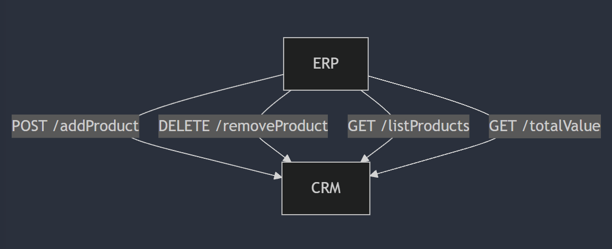
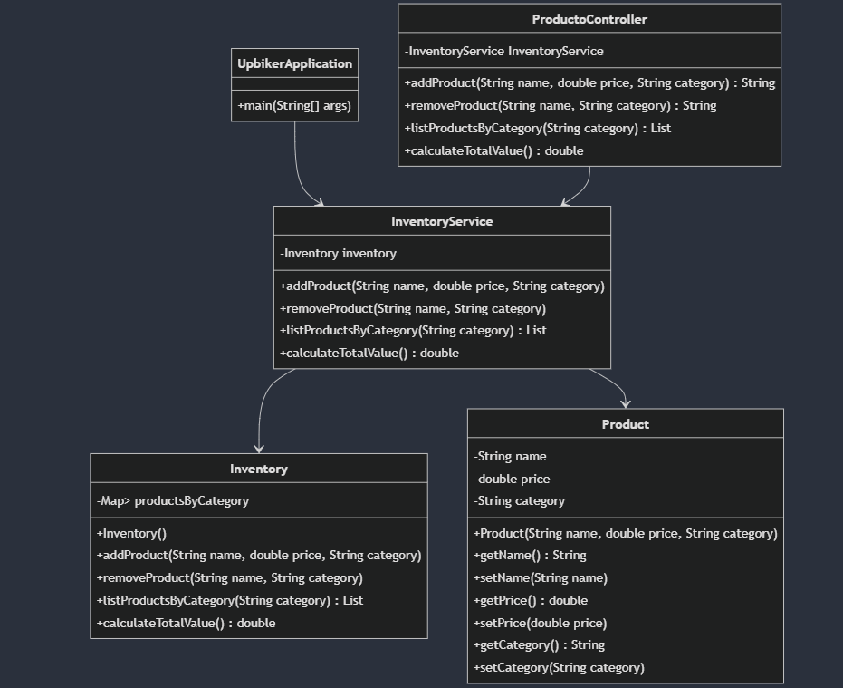
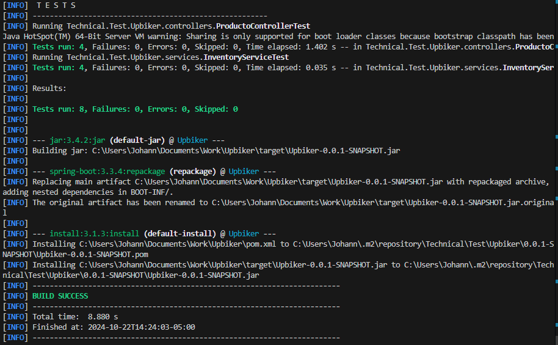

# Upbiker Inventory Management

## Overview
The Upbiker project is a RESTful API for managing product inventory. It allows users to add, remove, and list products by category, as well as calculate the total value of the inventory. The application is built using Spring Boot and follows a service-oriented architecture.

## Technologies Used
- **Java**: Programming language
- **Spring Boot**: Framework for building the application
- **Maven**: Dependency management
- **JUnit**: Testing framework
- **Mockito**: Mocking framework for unit tests

## Architecture
- **CRM**: Exposes services for the ERP to consume, allowing product management.
- **ERP**: Integrates with the CRM through HTTP requests, utilizing the exposed API methods.



## Class

### Product
Represents a product in the inventory with attributes for the name, price, and category. It includes getter and setter methods for these attributes.

### Inventory
Manages products by category. It allows adding, removing, and listing products, as well as calculating the total value of all products in the inventory.

### InventoryService
Service class that acts as an intermediary between the controller and the inventory. It contains methods to add and remove products, list products by category, and calculate the total inventory value.

### ProductoController
REST controller that exposes API endpoints for managing the product inventory. It handles incoming HTTP requests and interacts with the `InventoryService` to perform operations.

## Class diagram



## API Endpoints

### Add a Product
- **URL**: `/api/inventario/add`
- **Method**: `POST`
- **Parameters**:
  - `name`: The name of the product
  - `price`: The price of the product
  - `category`: The category of the product
- **Response**: Confirmation message

### Remove a Product
- **URL**: `/api/inventario/remove`
- **Method**: `DELETE`
- **Parameters**:
  - `name`: The name of the product
  - `category`: The category of the product
- **Response**: Confirmation message

### List Products by Category
- **URL**: `/api/inventario/list`
- **Method**: `GET`
- **Parameters**:
  - `category`: The category of products to retrieve
- **Response**: List of products in the specified category

### Calculate Total Value
- **URL**: `/api/inventario/totalValue`
- **Method**: `GET`
- **Response**: Total value of the inventory

## Testing with Postman

You can test the API using Postman by following these steps:

1. **Add a Product**:
   - Set the request method to `POST`.
   - Enter the URL: `http://localhost:8080/api/inventory/add`.
   - Go to the **Body** tab, select **x-www-form-urlencoded**, and add the following parameters:
     - `name`: Product name (e.g., "Product1")
     - `price`: Product price (e.g., 100.0)
     - `category`: Product category (e.g., "Category1")
   - Click **Send**.

The example you provided:

```
http://localhost:8080/api/inventory/add?name=MountainBike&price=500&category=Bicycles
```

is **correct** and follows the proper structure for making a **POST** request to the API you defined. Below are several examples for each endpoint, so you can test various requests in **Postman**.

### 1. **POST `/add` - Add Product**

URL:
```
http://localhost:8080/api/inventory/add
```

#### Example parameters:
- **Add a mountain bike**:
  ```
  name = MountainBike
  price = 500
  category = Bicycles
  ```

  In Postman:
  ```
  http://localhost:8080/api/inventory/add?name=MountainBike&price=500&category=Bicycles
  ```

- **Add a cycling helmet**:
  ```
  name = CyclingHelmet
  price = 50
  category = Accessories
  ```

  In Postman:
  ```
  http://localhost:8080/api/inventory/add?name=CyclingHelmet&price=50&category=Accessories
  ```

---

2. **Remove a Product**:
   - Set the request method to `DELETE`.
   - Enter the URL: `http://localhost:8080/api/inventory/remove`.
   - Go to the **Body** tab, select **x-www-form-urlencoded**, and add the following parameters:
     - `name`: Product name to remove (e.g., "Product1")
     - `category`: Product category (e.g., "Category1")
   - Click **Send**.

   ### 2. **DELETE `/remove` - Remove Product**

URL:
```
http://localhost:8080/api/inventory/remove
```

#### Example parameters:
- **Remove the mountain bike**:
  ```
  name = MountainBike
  category = Bicycles
  ```

  In Postman:
  ```
  http://localhost:8080/api/inventory/remove?name=MountainBike&category=Bicycles
  ```

- **Remove the cycling helmet**:
  ```
  name = CyclingHelmet
  category = Accessories
  ```

  In Postman:
  ```
  http://localhost:8080/api/inventory/remove?name=CyclingHelmet&category=Accessories
  ```

---

3. **List Products by Category**:
   - Set the request method to `GET`.
   - Enter the URL: `http://localhost:8080/api/inventory/list?category=Category1`.
   - Click **Send** to see the list of products in the specified category.

   
### 3. **GET `/list` - List Products by Category**

URL:
```
http://localhost:8080/api/inventory/list
```

#### Example parameters:
- **List products in the bicycles category**:
  ```
  category = Bicycles
  ```

  In Postman:
  ```
  http://localhost:8080/api/inventory/list?category=Bicycles
  ```

- **List products in the accessories category**:
  ```
  category = Accessories
  ```

  In Postman:
  ```
  http://localhost:8080/api/inventory/list?category=Accessories
  ```

---

4. **Calculate Total Value**:
   - Set the request method to `GET`.
   - Enter the URL: `http://localhost:8080/api/inventory/totalValue`.
   - Click **Send** to see the total value of the inventory.

### 4. **GET `/totalValue` - Calculate the Total Inventory Value**

URL:
```
http://localhost:8080/api/inventory/totalValue
```

No parameters required.

#### Example:
In Postman:
```
http://localhost:8080/api/inventory/totalValue
```

You should receive the total sum of the value of all products in the inventory, in numeric format (e.g., `550.0`).

## Running the Application
1. Clone the repository.
2. Navigate to the project directory.
3. Use Maven to build the project:
   ```bash
   mvn clean install
   ```
4. Run the application:
   ```bash
   mvn spring-boot:run
   ```

## Testing
To run the tests, use the following command:
```bash
mvn test
```



---

### Test Summary

This project includes two test classes to ensure the functionality of the product management system:

#### 1. **`ProductoControllerTest`**
Tests the `ProductoController`, which handles product-related requests. The key tests include:

- **Add Product**: Verifies that a product can be added successfully and checks the response message.
- **Remove Product**: Ensures a product can be removed and verifies the response message.
- **List Products by Category**: Tests that the correct list of products is returned for a given category.
- **Calculate Total Value**: Checks that the total inventory value is calculated correctly.

#### 2. **`InventoryServiceTest`**
Tests the `InventoryService`, which contains the business logic for product management. The key tests include:

- **Add Product**: Validates that a product is added and verifies its details.
- **Remove Product**: Ensures a product is removed correctly and checks that the product list is empty.
- **List Products by Category**: Confirms that the correct number of products is returned for a category.
- **Calculate Total Value**: Verifies that the total value of all products is calculated accurately.

These tests help ensure that both the controller and service layers work as intended.
## License
This project is licensed under the MIT [License](LICENSE)